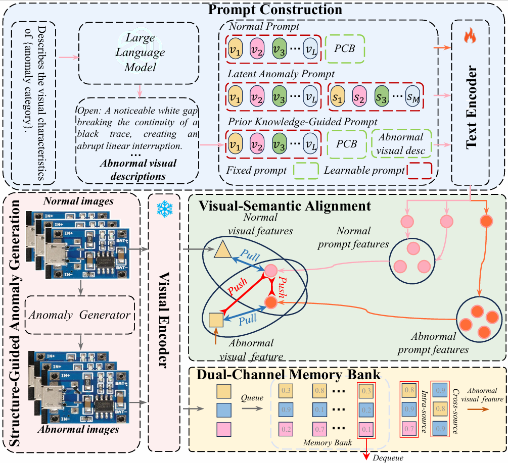

# CoPro: Cross-Modal Prompt Learning for Few-Shot Printed Circuit Boards Defect Detection

[English](#english) | [中文](#中文)


## English 

### 📄 Overview

**Title:** Cross-Modal Prompt Learning for Few-Shot Printed Circuit Boards Defect Detection

**Abstract:**

Visual Language Models (VLMs) have demonstrated significant potential in industrial printed circuit boards (PCBs) defect detection, particularly in few-shot scenarios. However, existing methods mostly adopt the coarse category-level prompts and thus may fail to capture the complex defect morphologies due to the lack of explicit anomaly guidance. This largely limits the ability of existing approaches to generalize to novel defect types. To address this issue, we present CoPro, a novel framework that leverages Cross-modal Prompt learning for semantic enhancement and visual feature guidance for more effective PCB defect detection. Specifically, to enrich the semantic context, CoPro employs Large Language Models (LLMs) to generate fine-grained textual descriptions guided by defect priors, establishing robust associations between visual and textual representations of various PCB defects. Furthermore, to address the issue of lack of PCB anomaly guidance, CoPro first generates synthetic samples and then employs a dual-channel memory bank to select the most discriminative intra-source variants and challenging cross-source variants. In this way, the instance-specific perturbations and cross-instance variations of the samples can be effectvely captured. Extensive experiments are conducted on three public PCB datasets that are widely adopted in PCB defect detection, and the results demonstrate that CoPro outperforms existing state-of-the-art methods.

---

<div align="center">



**CoPro Framework Overview**

</div>

---
### 🚀 Features

- **Cross-Modal Prompt Learning**: Leverages LLMs to generate fine-grained textual descriptions for enhanced semantic context
- **Dual-Channel Memory Bank**: Selects discriminative intra-source and challenging cross-source variants
- **Few-Shot Learning**: Effective defect detection with limited training samples (1-shot, 2-shot, 4-shot, 8-shot)
- **Multi-Dataset Support**: Tested on three public PCB datasets (DeepPCB, RealLAD, VisA-PCB)
- **Dual Tasks**: Supports both image-level classification and pixel-level segmentation

### 📦 Installation

#### Prerequisites

- Python 3.10
- CUDA-capable GPU (recommended)
- Conda (recommended)

#### Setup

```bash
# Create conda environment
conda create -n copro python==3.10
conda activate copro

# Install dependencies
pip install -r requirements.txt
```

### 📊 Dataset Preparation

CoPro supports the following PCB datasets:

- **[DeepPCB](https://github.com/tangsanli5201/DeepPCB)**: A comprehensive PCB defect detection dataset
- **[RealLAD](https://huggingface.co/datasets/Real-IAD/Real-IAD)**: Real-world PCB anomaly detection dataset
- **[VisA-PCB](https://github.com/amazon-science/spot-diff)**: PCB subset from the VisA dataset

#### Step-by-Step Dataset Setup

1. **DeepPCB**
   - Download the dataset from the official repository
   - Extract and modify the source path in `./datasets/deeppcb.py`

2. **RealLAD**
   - Download the dataset from the official repository
   - Modify the source path in `./datasets/reallad.py`

3. **VisA-PCB**
   ```bash
   # Modify source and target paths in prepare_visa_public.py
   python ./datasets/prepare_visa_public.py
   ```

### 🏃 Usage

#### Quick Start

CoPro provides convenient shell scripts for different few-shot settings:

```bash
# 1-shot learning
bash run_copro_shot1.sh

# 2-shot learning
bash run_copro_shot2.sh

# 4-shot learning
bash run_copro_shot4.sh

# 8-shot learning
bash run_copro_shot8.sh
```

#### Manual Execution

**Image-Level Classification:**

```bash
python train_cls.py \
    --dataset <dataset_name> \
    --k-shot <k> \
    --class_name <class> \
    --seed <seed> \
    --gpu-id <gpu_id> \
    --bank 16 \
    --root-dir <log_dir> \
    --lambda1 0.1
```

**Pixel-Level Segmentation:**

```bash
python train_seg.py \
    --dataset <dataset_name> \
    --k-shot <k> \
    --class_name <class> \
    --seed <seed> \
    --gpu-id <gpu_id> \
    --bank 16 \
    --root-dir <log_dir> \
    --lambda1 0.1
```

#### Example

```bash
# Classification example on RealLAD dataset
python train_cls.py \
    --dataset reallad \
    --k-shot 1 \
    --class_name pcb_reallad \
    --seed 111 \
    --gpu-id 0 \
    --bank 16 \
    --root-dir ./all_logs/cls_lambda1_0.1 \
    --lambda1 0.1
```

#### Key Parameters

- `--dataset`: Dataset name (`mvtec`, `visa`, `deeppcb`, `reallad`)
- `--k-shot`: Number of training samples (1, 2, 4, 8)
- `--class-name`: Specific class/category name
- `--seed`: Random seed for reproducibility
- `--gpu-id`: GPU device ID
- `--bank`: Memory bank size (default: 16)
- `--lambda1`: Loss weight hyperparameter (default: 0.1)
- `--root-dir`: Directory to save logs and results


### 🙏 Acknowledgments

We thank the following works for their contributions:

- [PromptAD](https://github.com/FuNz-0/PromptAD) - Learning Prompts with only Normal Samples for Few-Shot Anomaly Detection
- [WinCLIP](https://github.com/caoyunkang/WinClip.git) - Window-based CLIP for Anomaly Detection
- [CoOp](https://github.com/KaiyangZhou/CoOp.git) - Context Optimization for Prompt Learning


---

## 中文 

### 📄 概述

**标题:** 基于跨模态提示学习的少样本印刷电路板缺陷检测

**摘要:**

视觉语言模型(VLMs)在工业印刷电路板(PCB)缺陷检测领域展现出巨大潜力，尤其在少样本场景下表现突出。然而，现有方法大多采用粗粒度的类别级提示，由于缺乏明确的异常特征引导，往往难以捕捉复杂的缺陷形态。这种局限性严重制约了现有方法对新型缺陷类型的泛化能力。为解决这一问题，我们提出了CoPro创新框架，该框架通过跨模态提示学习实现语义增强，并结合视觉特征引导以提升PCB缺陷检测效能。具体而言，为丰富语义上下文，CoPro采用大语言模型(LLMs)，在缺陷先验知识指导下生成细粒度文本描述，从而建立各类PCB缺陷视觉表征与文本表征间的强关联。此外，针对PCB异常特征引导缺失的问题，CoPro首先生成合成样本，继而通过双通道记忆库筛选最具区分度的同源变体与极具挑战性的跨源变体。这种方式能有效捕捉样本特有的局部扰动及跨样本的全局变异。我们在三个广泛使用的PCB缺陷检测公开数据集上进行了大量实验，结果表明CoPro在性能上显著优于当前最先进的方法。

### 🚀 特性

- **跨模态提示学习**：利用 LLMs 生成细粒度文本描述以增强语义上下文
- **双通道记忆库**：选择具有判别力的源内和具有挑战性的跨源变体
- **少样本学习**：在有限训练样本下实现有效的缺陷检测（1-shot、2-shot、4-shot、8-shot）
- **多数据集支持**：在三个公共 PCB 数据集（DeepPCB、RealLAD、VisA-PCB）上测试
- **双任务支持**：支持图像级分类和像素级分割

### 📦 安装

#### 环境要求

- Python 3.10
- CUDA 环境 12.2
- Conda（推荐）

#### 安装步骤

```bash
# 创建 conda 环境
conda create -n copro python==3.10
conda activate copro

# 安装依赖
pip install -r requirements.txt
```

### 📊 数据集准备

CoPro 支持以下 PCB 数据集：

- **[DeepPCB](https://github.com/tangsanli5201/DeepPCB)**: 综合的 PCB 缺陷检测数据集
- **[RealLAD](https://huggingface.co/datasets/Real-IAD/Real-IAD)**: 真实世界 PCB 异常检测数据集
- **[VisA-PCB](https://github.com/amazon-science/spot-diff)**: VisA 数据集中的 PCB 子集

#### 数据集设置步骤

1. **DeepPCB**
   - 从官方仓库下载数据集
   - 解压并修改 `./datasets/deeppcb.py` 中的源路径

2. **RealLAD**
   - 从官方仓库下载数据集
   - 修改 `./datasets/reallad.py` 中的源路径

3. **VisA-PCB**
   ```bash
   # 修改 prepare_visa_public.py 中的源路径和目标路径
   python ./datasets/prepare_visa_public.py
   ```

### 🏃 使用方法

#### 快速开始

CoPro 为不同的少样本设置提供了便捷的 shell 脚本：

```bash
# 1-shot 学习
bash run_copro_shot1.sh

# 2-shot 学习
bash run_copro_shot2.sh

# 4-shot 学习
bash run_copro_shot4.sh

# 8-shot 学习
bash run_copro_shot8.sh
```

#### 手动执行

**图像级分类：**

```bash
python train_cls.py \
    --dataset <dataset_name> \
    --k-shot <k> \
    --class_name <class> \
    --seed <seed> \
    --gpu-id <gpu_id> \
    --bank 16 \
    --root-dir <log_dir> \
    --lambda1 0.1
```

**像素级分割：**

```bash
python train_seg.py \
    --dataset <dataset_name> \
    --k-shot <k> \
    --class_name <class> \
    --seed <seed> \
    --gpu-id <gpu_id> \
    --bank 16 \
    --root-dir <log_dir> \
    --lambda1 0.1
```

#### 示例

```bash
# 在 RealLAD 数据集上进行分类的示例
python train_cls.py \
    --dataset reallad \
    --k-shot 1 \
    --class_name pcb_reallad \
    --seed 111 \
    --gpu-id 0 \
    --bank 16 \
    --root-dir ./all_logs/cls_lambda1_0.1 \
    --lambda1 0.1
```

#### 关键参数

- `--dataset`: 数据集名称（`mvtec`, `visa`, `deeppcb`, `reallad`）
- `--k-shot`: 训练样本数量（1, 2, 4, 8）
- `--class-name`: 特定类别名称
- `--seed`: 随机种子（用于可复现性）
- `--gpu-id`: GPU 设备编号
- `--bank`: 记忆库大小（默认：16）
- `--lambda1`: 损失权重超参数（默认：0.1）
- `--root-dir`: 保存日志和结果的目录


### 🙏 致谢

我们感谢以下工作的贡献：

- [PromptAD](https://github.com/FuNz-0/PromptAD) - 仅使用正常样本学习提示的少样本异常检测
- [WinCLIP](https://github.com/caoyunkang/WinClip.git) - 基于窗口的 CLIP 异常检测
- [CoOp](https://github.com/KaiyangZhou/CoOp.git) - 提示学习的上下文优化

---

## 📧 Contact

For questions or issues, please open an issue on GitHub or contact the authors.

如有问题或建议，请在 GitHub 上提交 issue 或联系作者。
